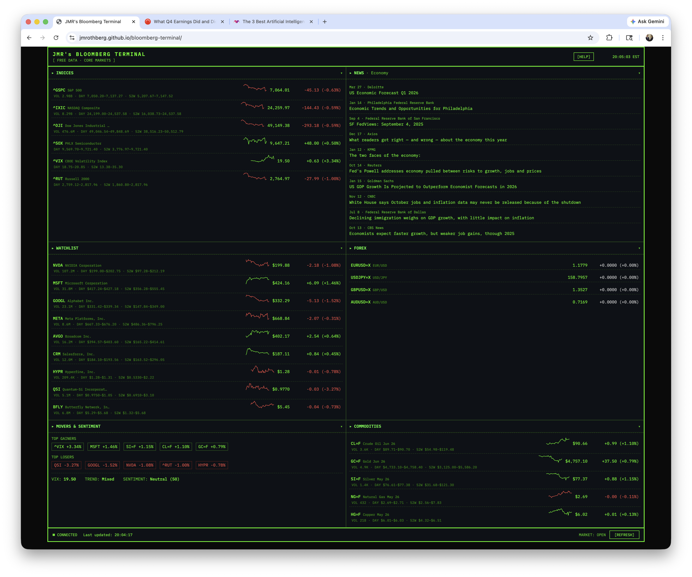

# Rothberg Terminal

A single-file, browser-only clone of the Bloomberg Terminal — phosphor-green monospace, dense data panels, pull-down configuration — powered entirely by **free, public data sources**. No API keys. No backend. No build step.

## ► [LAUNCH THE TERMINAL →](https://jmrothberg.github.io/rothberg-terminal/)

[](https://jmrothberg.github.io/rothberg-terminal/)

> Click the screenshot or the launch link above to open the live terminal in your browser. No install, no signup, no keys.

---

```
┌─────────────────────────────────────────────────────────────────┐
│ JMR's BLOOMBERG TERMINAL           [ FREE DATA · CORE MARKETS ] │
├─────────────────────────────┬───────────────────────────────────┤
│ ▸ INDICES ▾                 │ ▸ NEWS · Markets ▾                │
│   ^GSPC   5,423.45  +0.45%  │   12m ago · Reuters               │
│   ^IXIC  17,890.22  +0.72%  │   Fed signals rate hold…          │
│   ^DJI   42,512.10  +0.31%  │                                   │
│   ^VIX      14.32   -2.14%  │   18m ago · CNBC                  │
│                             │   NVIDIA earnings beat…           │
├─────────────────────────────┼───────────────────────────────────┤
│ ▸ WATCHLIST ▾               │ ▸ CRYPTO ▾                        │
│   NVDA    $875.23   +2.4%   │   BTC-USD  $75,496  -0.55%        │
│   MSFT    $415.67   +0.8%   │   ETH-USD   $2,311  -0.34%        │
│   GOOGL   $175.89   +1.1%   │   SOL-USD     $148  +1.82%        │
├─────────────────────────────┼───────────────────────────────────┤
│ ▸ MOVERS & SENTIMENT ▾      │ ▸ COMMODITIES ▾                   │
│   GAINERS: NVDA +2.4%…      │   CL=F  (Oil)    $78.42  +1.2%    │
│   LOSERS:  INTC -1.1%…      │   GC=F  (Gold) $2,412.10 +0.4%    │
│   VIX 14.32  SENTIMENT:     │   SI=F  (Silver)   $28.90 +0.9%   │
│   Greed (67)                │                                   │
└─────────────────────────────┴───────────────────────────────────┘
```

---

## Two differences from the real Bloomberg

1. **All data is free and public.** No Bloomberg subscription. No paid APIs. No keys to obtain. Quotes come from Yahoo Finance (via public CORS proxies), crypto from CoinGecko, forex from open.er-api.com, news from Google News RSS.
2. **Super-easy UI.** Real Bloomberg uses `NVDA <EQUITY> <GO>` keyboard syntax. This clone uses pull-down trays — click a panel title, tap a panel-type chip to change what it shows, type a ticker and press Enter to add it.

---

## Features

### Design — four buckets

Every panel type sorts into one of four buckets, and that's the discipline:

1. **Price instruments** — `STOCKS`, `INDICES`, `CRYPTO`, `FOREX`, `COMMODITIES`, `TREASURIES`. Structured numeric quotes.
2. **Information flow** — `NEWS`, `CALENDAR`, `MOVERS`, `PREDICTION MARKETS`. Narrative + schedule + probabilistic risk. `CALENDAR` straddles macro and energy — a `Macro / Energy / All` chip in the tray filters between BLS / Fed / BEA releases and EIA weeklies + STEO.
3. **Visualization** — **Heat map** as a **DISPLAY** mode on any price panel (same symbols as the quote table). Not a separate panel type — open the tray, use **DISPLAY → HEAT MAP** vs **ENTERED** / **A↔Z** / **%**.
4. **Leading-indicator risk signals** — `SEISMIC EVENTS`, `TROPICAL CYCLONES`, **`EARTH EVENTS (NASA)`** (EONET). Physical-world events with lat/lon (and size when published): quakes/hurricanes plus wildfire, volcano, dust, drought, and related hazards — useful for explaining or front-running moves in **utilities, insurers, ag, solar, airlines, shipping**, and regional equities before headlines fully price them in.

The rules for adding more panel types: free CORS-friendly API, threshold that maps to a tradeable instrument, fits the existing list-with-drilldown idiom. **EXTERNAL ACCOUNT** is the exception: it ingests **your** Fidelity `Portfolio_Positions*.csv` locally (no Fidelity API). That's why there's no flights / nuclear / cyber-KEV / elections firehose — the signal/noise ratio doesn't survive contact with a trading UI.

### Fourteen panel types — reassign any panel to any type

Heat map is **not** listed here — it is a **DISPLAY** option on the types below that load symbols (**STOCKS**, **INDICES**, **CRYPTO**, **FOREX**, **COMMODITIES**, **TREASURIES**). See [Display and heat map](#display-and-heat-map-hmap-style).

| Type | What it shows | Default symbols |
|---|---|---|
| **STOCKS** | Individual equity watchlist | `NVDA MSFT GOOG META AVGO CRM BFLY HYPR QSI INTC MU GFS AMD EWY AMZN ASML TSM` |
| **INDICES** | Market indices | `^GSPC ^IXIC ^DJI ^SOX ^VIX ^RUT` |
| **CRYPTO** | Cryptocurrencies | `BTC-USD ETH-USD SOL-USD DOGE-USD` |
| **FOREX** | Currency pairs | `EURUSD=X USDJPY=X GBPUSD=X AUDUSD=X` |
| **COMMODITIES** | Futures contracts | `CL=F GC=F SI=F NG=F HG=F` |
| **TREASURIES** | US bond yields | `^IRX ^FVX ^TNX ^TYX` |
| **NEWS** | Financial headlines by topic | Markets · **Watchlist** (Google News over every ticker in your **WATCHLIST** panels) · Tech/AI · Semis · Crypto · Economy · Energy · Politics · World · Chokepoints · **EIA** (*Today in Energy* RSS — [U.S. Energy Information Administration](https://www.eia.gov/)) + custom; tray **SAVED** row lists custom topics with `[×]` to remove (same idea as watchlist tags). Custom topics persist in the saved layout (localStorage / `[EXPORT]` JSON), like symbols. |
| **CALENDAR** | Upcoming US releases (macro + energy) with a `Macro / Energy / All` filter | Computed (CPI, NFP, FOMC, PCE, GDP + EIA WPSR / Nat Gas Storage / STEO). Each release title links to the agency’s official schedule or data page. |
| **MOVERS** | Derived top gainers/losers, VIX, sentiment | From loaded quotes |
| **PREDICTION MARKETS** | Live Polymarket markets ranked by 24h volume | Filter: All · Politics · Crypto · Sports · Elections · Economics |
| **SEISMIC EVENTS** | Live USGS earthquake feed (M4.5+ last 7 days) | Threshold: M4.5 · M5 · M5.5 · M6 · M7 |
| **TROPICAL CYCLONES** | Active NOAA NHC storms with Saffir-Simpson category | Basin: All · Atlantic · East Pacific · Central Pacific |
| **EARTH EVENTS (NASA)** | NASA [EONET](https://eonet.gsfc.nasa.gov/) open natural-hazard events (last 14 days) | **FILTER:** All · Fire · Volc · Dust · Dry · Storm · Ice · Slide — each chip is a one-line “why markets care” hint in the tray; **DISPLAY → GLOBE** uses the same filtered feed (polygon → centroid). **No API key.** When every open EONET panel shares the same chip (not ALL), that category loads first and the full open-events feed merges in the background. Globe dots use distinct colors per hazard and size scales within each type in the current view. When NASA gives a numeric size (e.g. acres, kt), it shows on the row; otherwise globe weight blends footprint + recency (not comparable to Richter). |
| **EXTERNAL ACCOUNT** | Fidelity **Portfolio_Positions*.csv** (export from Positions) | **LOAD CSV** — file picker uses **Downloads** as the suggested start folder when the browser supports it (`showOpenFilePicker`); otherwise a normal file chooser. **One file per panel**: a new load replaces the CSV snapshot but **keeps Yahoo symbol overrides** keyed by the CSV **`Symbol`** cell (e.g. CUSIP `12499D575` → `BFLY`), so the same mapping applies after next week’s export if that identifier still appears. **FILE** row shows the filename with **`[×]`** to clear (same pattern as watchlist tags / NEWS saved topics). The first **ACCOUNT** chip is **`TOTALS!`** (synthetic): every row in the file across **non-hidden** accounts (hiding an account with **`[×]`** removes it from **TOTALS!** too; re-importing a CSV without that account does the same), with **TOTAL** summing **VALUE**, **COST** (where known), and **P/L $**; each real account name gets its own chip with **`[×]`** to hide it until you clear the file or that account disappears from the CSV. **Prices are always live Yahoo quotes** — the CSV **Last Price** is never shown. In the holdings grid, **PRICE** uses **two decimal places** (live quote or weighted average); **VALUE**, **COST**, dollar **P/L $**, and the **TOTAL** row use **whole dollars** (no cents); **P/L %** stays a whole percent. **DISPLAY** (after a CSV is loaded) matches the watchlist pattern: **ENTERED** (CSV / account order), **A↕Z**, **% PORT** (combines identical Yahoo symbols and sorts by share of total **VALUE**; adds a **%PORT** column), and **HEAT MAP** (one tile per combined symbol, size ∝ value, color = day change%). **HEAT MAP** and **% PORT** both merge lines that share the same resolved quote symbol. **SYM** column: click the identifier, type the Yahoo ticker, Enter (under **TOTALS!**, the account name appears after the symbol). **COST** shows Fidelity cost basis when the CSV has it; otherwise click **—** and enter **average cost per share**; on **Enter** the app multiplies by **QTY** and stores the same **total cost basis** as Fidelity’s “Cost Basis Total”, keyed by **`resolved Yahoo ticker \| quantity`** so row order in the file can change without losing the number (two lines with the same ticker and quantity would share one manual cost — rare). **TOTAL** aggregate **P/L %** is **—** (not a blended portfolio percent). Value and P/L use live price × quantity vs cost when both exist; otherwise those cells show **—** until a quote is available. |

### Per-row extras

- **1-day sparklines** — every quote row renders a tiny 64×20 SVG line chart built from the intraday close series. Green if the day is up, red if down.
- **Extended quote columns** — VOL (with K/M/B suffix) plus DAY range and 52W range render under every price.

### Click-a-row drilldown (`[SYM] <GO>`)

Click any equity/index/crypto/commodity/forex/bond row to open a full-screen drilldown:

- **Multi-range chart** — 1D · 5D · 1M · 3M · YTD · 1Y · 5Y, with a dashed `prev close` reference line on the 1D view
- **Fundamentals grid** — P/E (TTM + Forward), Market Cap, EPS, PEG, P/S, Enterprise Value, EV/Rev, Revenue (TTM), Net Income (TTM), 52W High/Low
- **Sector / industry / exchange tags**
- **Per-ticker recent news** — 5 most recent Google News headlines for that company
- **`[×]`** or **`ESC`** closes the drilldown

Data sourced from Yahoo's crumb-free `fundamentals-timeseries` and `v1/search` endpoints (no key required).

### Prediction markets (Polymarket)

The `PREDICTION MARKETS` panel lists the top 20 active Polymarket markets by 24-hour volume, with YES/NO probability bars, volume, and days-to-resolution. Click any row for a full-screen drilldown:

- **Probability history chart** — 1H · 6H · 1D · 1W · 1M · MAX (data from Polymarket's CORS-open CLOB endpoint)
- **Market stats grid** — 24h vol, total vol, liquidity, bid/ask, spread, 1W / 1M change, resolution date, days left
- **Full market description** + link to Polymarket
- **Related news** — Google News RSS searched on the market question

### Display and heat map (HMAP-style)

On any **price** panel (**STOCKS**, **INDICES**, **CRYPTO**, **FOREX**, **COMMODITIES**, **TREASURIES**), open the tray and use the **DISPLAY** row:

- **ENTERED** — table in the order you typed symbols  
- **A↔Z** / **%** — sort the table by symbol or day change  
- **HEAT MAP** — same symbol list as the table, but as a Bloomberg-style **squarified treemap**: tiles sized by market cap, colored on a diverging red↔green ramp by day change, grouped into sector buckets  

**HEAT MAP** toggles off when you pick **ENTERED** or a sort chip (or click **HEAT MAP** again). There is no separate “heat map panel type” and no **SOURCE** dropdown — the treemap always reflects **this** panel’s symbols.

Click any tile to open the ticker drilldown. Sector weights come from Yahoo’s fundamentals endpoint; first paint uses equal-weighted `UNCLASSIFIED` tiles and re-lays out as sectors resolve.

### Physical-world risk feeds (seismic + tropical cyclones)

Three panel types surface structured, real-world events that move markets before the news cycle prices them in. They render in the same list-with-drilldown shape as `NEWS`, auto-refresh on the same tick as quotes, and drop into the existing grid without any UI rethink.

#### How it helps investors

- **Lead time on sector moves.** A M6+ near Hsinchu, a Gulf hurricane forming, or a Red Sea tanker incident all hit the physical feed 30–120s before the headline reaches Reuters / Yahoo. Enough time to pull up `TSM`, `NG=F`, or `BDRY` before the tape moves.
- **Explains price action.** When a stock gaps on your watchlist, a glance at the events panel tells you why. The news panel lags and is noisy; a structured physical feed answers "what just happened in the real world?" in one row.
- **Sector / ticker attribution (mental map).** Taiwan / Japan → `TSM`, `ASML`, semis + autos. Gulf Coast → `XLE`, `CL=F`, `NG=F`, Florida insurers. Hormuz → `XOM`, tanker ETFs. Chile → copper miners. A disaster in any of those regions tells you which of *your* tickers to check first.
- **Covers blind spots in the other panels.** `PREDICTION MARKETS` covers *probabilistic* risk (will X happen?). `NEWS` covers *narrated* risk (Reuters says X happened). `SEISMIC` / `TROPICAL CYCLONES` / **`EARTH EVENTS (NASA)`** cover *physical* risk — it already happened, structured as `lat/lon` plus category (and NASA-reported size when present). The terminal couldn't answer that before.

#### What's in each panel

- **SEISMIC EVENTS** — USGS M4.5+ worldwide feed, last 7 days. Magnitude threshold chip (`M4.5` / `M5` / `M5.5` / `M6` / `M7`) filters the list. Each row is color-coded by severity — dim for sub-5, green for moderate, red for M6+, red-filled for M7+. Rows show depth in km, a `TSUNAMI` tag when USGS flags one, and link to the event's USGS detail page.
- **TROPICAL CYCLONES** — NOAA National Hurricane Center active-storms feed. Basin chip (`All` / `Atlantic` / `East Pacific` / `Central Pacific`). Each row shows the Saffir-Simpson category derived from 1-minute sustained wind (or `TD` / `TS` for sub-hurricane systems), wind speed in mph, central pressure in mb, and links to the NHC public advisory.

- **EARTH EVENTS (NASA)** — NASA EONET `events/geojson` (open events, last 14 days). **FILTER** chips narrow one list and one optional globe: wildfires (utilities / REITs / insurers), volcanoes (airlines / cargo), dust & haze (solar / ports), drought (ag / barges), severe storms, sea/lake ice, landslides. Tray tooltips spell out the **investment angle**; this is **not** armed-conflict mapping (use `NEWS` for that narrative). Same **DISPLAY → GLOBE** pattern as seismic/storms; coastlines load from Natural Earth via jsDelivr.

(The internal state key for tropical cyclones is `storms` — short, snake-friendly — but the user-facing label is `TROPICAL CYCLONES` because that's the meteorological umbrella the NHC uses; tropical depressions, tropical storms, and hurricanes are all tropical cyclones at different intensities.)

#### Chokepoints news preset

Complementing the structured feeds above, `NEWS` gains a **Chokepoints** topic preset — a curated Google News query for shipping / supply-chain disruption (Red Sea, Suez, Panama, Strait of Hormuz, tanker incidents). Ripples into oil (`CL=F`), nat-gas (`NG=F`), container shippers, and the dry-bulk ETF (`BDRY`) before the move shows in price panels. No new infrastructure — rides on the existing news engine.

All three structured hazard feeds refresh on the same 60s tick as quotes and news.

### EIA integration

**EIA** is the **U.S. Energy Information Administration** — the federal agency (within the Department of Energy) responsible for official U.S. energy statistics, analysis, and short-term outlooks. In the terminal, “EIA” usually means either that agency’s data schedule (calendar) or its **Today in Energy** editorial RSS feed (news).

The terminal touches EIA in two places, with very different levels of "integration":

#### Release schedule (dates only — **no API calls**)

`CALENDAR` panels gain a `Macro · Energy · All` chip filter in the tray. Under `Energy` you see three EIA releases whose dates are **computed client-side from weekday math** — the code knows that WPSR is always Wednesday and Nat Gas Storage is always Thursday; it never fetches anything from EIA to build the list. These are baked-in schedule rules, not a data source.

- **Weekly Petroleum Status Report (WPSR)** — every Wednesday 10:30 ET. Crude + gasoline + distillate stocks. Moves `CL=F` and `RB=F` ~2% on surprise; `XLE` constituents track closely.
- **Weekly Natural Gas Storage** — every Thursday 10:30 ET. Working gas in underground storage. Moves `NG=F` 3–5% on winter / summer surprises.
- **Short-Term Energy Outlook (STEO)** — 2nd Tuesday monthly. Absorbed the Drilling Productivity Report in June 2024, so one entry covers both.

Live EIA **numeric** data (actual inventory levels, storage volumes, retail prices) is **explicitly not wired**. The v2 API at `api.eia.gov` requires a per-user API key, which would break the terminal's no-keys promise; routing keyed URLs through the public CORS proxy rotation would also leak those keys to the proxy operator.

#### EIA Today in Energy (real RSS fetch via proxy)

`NEWS` panels include an **EIA** topic chip that pulls [EIA's Today in Energy RSS feed](https://www.eia.gov/rss/todayinenergy.xml) directly (authored by the **U.S. Energy Information Administration**, not third-party headlines). It uses the same CORS-proxy rotation as Google News RSS. Use it alongside the release calendar: the calendar tells you *when* a WPSR or Nat Gas print is coming; **Today in Energy** gives EIA’s own write-up of recent prints and context. No API key required.

The broader `Energy` chip remains a curated Google-News search (`crude oil OPEC natural gas refinery gasoline diesel WPSR EIA inventory`) if you want a wider net that includes Reuters / Bloomberg / CNBC coverage.

### Extended hours (pre-market / after-hours)

`WATCHLIST` and `INDICES` panels have an `EXT HRS` toggle in the tray (per-panel — each panel remembers its own setting). When ON and the market is in a pre-market or after-hours session, the row swaps to show the extended-session price, change, and volume, with a gold `PRE` or `AH` badge next to the price and a `REG CLOSE $XXX.XX` tag in the meta row so the regular close is never lost. The panel title gains a gold `· EXT` marker. During regular hours with the toggle ON, rows show a dim `REG` badge but display normal regular-session values. Toggle OFF to hide badges and extended data entirely. Backed by Yahoo Finance's `includePrePost=true` chart endpoint.

### Interactions

- **Click any panel title** → tray slides down in phosphor green
- **Panel-type chips** → reassign that panel to any of the 12 types
- **DISPLAY row** (price panels) → **ENTERED** / **A↔Z** / **%** for the quote table, or **HEAT MAP** for the sector treemap (same symbols)
- **Type symbol + Enter** → validated against live data and added to the panel
- **Autocomplete** → as you type, the tray suggests matching tickers (via Yahoo search)
- **`[×]` next to a symbol** → remove it
- **Custom news query** → type any search and make your own news topic

### State persistence

Your panel layout, assignments, symbols, and news topic are saved to `localStorage` under `bloomberg_state_v2`. Reload the page — everything stays. Clear the key to reset.

---

## Quick start

### Option A — Live on GitHub Pages (recommended)

Just open the demo link — no install, no setup:

### 🟢 **[► https://jmrothberg.github.io/rothberg-terminal/ ◄](https://jmrothberg.github.io/rothberg-terminal/)**

### Option B — Run locally

Clone and open in a browser:

```bash
git clone https://github.com/jmrothberg/rothberg-terminal.git
cd rothberg-terminal
open index.html
```

If `file://` gives you CORS trouble in Firefox's strict mode, serve with Python:

```bash
python3 -m http.server 8000
# then visit http://localhost:8000/
```

No `npm install` required. `package.json` only exists for an optional Playwright dev dependency.

---

## Keyboard shortcuts

| Key | Action |
|---|---|
| `R` | Refresh all panels |
| `H` | Toggle help |
| `ESC` | Close help / close open tray |
| `Enter` *(in symbol input)* | Add typed symbol |
| `↑` / `↓` *(in symbol input)* | Navigate autocomplete |

---

## Symbol format cheatsheet

The terminal accepts Yahoo Finance ticker syntax across every panel type:

| Asset class | Format | Examples |
|---|---|---|
| US equities | Plain ticker | `NVDA`, `AAPL`, `TSLA`, `BRK-B` |
| Indices | `^` prefix | `^GSPC` (S&P 500), `^IXIC` (NASDAQ), `^DJI` (Dow), `^VIX`, `^RUT` (Russell 2k), `^SOX` (Philadelphia Semi) |
| Crypto | `-USD` suffix | `BTC-USD`, `ETH-USD`, `SOL-USD`, `DOGE-USD`, `ADA-USD` |
| Forex | `=X` suffix | `EURUSD=X`, `USDJPY=X`, `GBPUSD=X`, `AUDUSD=X` |
| Commodity futures | `=F` suffix | `CL=F` (Oil), `GC=F` (Gold), `SI=F` (Silver), `NG=F` (Nat Gas), `HG=F` (Copper) |
| Treasury yields | `^` prefix | `^IRX` (13wk), `^FVX` (5Y), `^TNX` (10Y), `^TYX` (30Y) |
| International stocks | `.XX` suffix | `TSM`, `ASML.AS`, `7203.T` (Toyota, Tokyo) |

Don't know the ticker? Start typing the company name — autocomplete will suggest matches.

---

## Data sources

Every number on the screen is from one of these free, public sources. No API key is required for any of them.

| Panel | Primary source | Fallback | Why |
|---|---|---|---|
| Crypto | [CoinGecko public API](https://www.coingecko.com/en/api) | Yahoo via proxy | CoinGecko is CORS-open — works without a proxy |
| Forex | [open.er-api.com](https://open.er-api.com) | Yahoo via proxy | Also CORS-open |
| Stocks / Indices / Commodities / Bonds | [Yahoo Finance chart endpoint](https://query1.finance.yahoo.com/v8/finance/chart/) | Proxy rotation: allorigins → codetabs → corsproxy | Yahoo has no CORS header, so a public proxy is needed |
| Ticker search / autocomplete | Yahoo Finance search endpoint (via proxy) | — | |
| News | [Google News RSS](https://news.google.com/rss/search) (via proxy) | — | RSS parsed with `DOMParser` |
| Economic calendar (macro + energy schedule) | Computed client-side from US release schedule | — | CPI, NFP, FOMC 2026, PCE, GDP + WPSR / Nat Gas Storage / STEO weekday math — schedule only, **no API calls** |
| EIA Today in Energy | [`https://www.eia.gov/rss/todayinenergy.xml`](https://www.eia.gov/rss/todayinenergy.xml) (via proxy) | — | Real RSS fetch of EIA's editorial analysis feed via the same proxy rotation as Google News |
| Movers / VIX / Fear-Greed | Derived locally from loaded quotes | — | No network call — free reduction |
| Prediction markets list | [Polymarket Gamma API](https://docs.polymarket.com/api-reference/introduction) (via proxy) | — | Gamma has no CORS header; same proxy rotation as Yahoo |
| Prediction history chart | [Polymarket CLOB](https://docs.polymarket.com/api-reference/clob) `prices-history` | — | CLOB is CORS-open — direct fetch, no proxy |
| Heat map (DISPLAY mode on symbol panels) | Yahoo `fundamentals-timeseries` + `v1/search` | — | Treemap sectors / market caps — same endpoints as drilldown; not a separate panel |
| Seismic events | [USGS M4.5+ week feed](https://earthquake.usgs.gov/earthquakes/feed/v1.0/summary/4.5_week.geojson) | — | CORS-open GeoJSON, direct fetch |
| Tropical cyclones | [NOAA NHC `CurrentStorms.json`](https://www.nhc.noaa.gov/CurrentStorms.json) (via proxy) | — | NHC doesn't serve CORS headers; same proxy rotation as Yahoo |
| Earth events (NASA EONET) | [`api/v3/events/geojson`](https://eonet.gsfc.nasa.gov/api/v3/events/geojson) | — | CORS-open (`Access-Control-Allow-Origin: *`); falls back to the same proxy rotation if a browser blocks direct fetch |

### CORS proxies tried in order

The app rotates through these public proxies on failure:

1. `api.allorigins.win/raw`
2. `api.codetabs.com/v1/proxy`
3. `corsproxy.io`

Whichever one succeeds becomes the preferred proxy for subsequent requests in that session.

---

## Architecture

**Single HTML file. Vanilla JS. Zero build step.**

- **UI:** ~400 lines of CSS (phosphor-on-black, IBM Plex Mono), ~80 lines of HTML shell
- **Logic:** ~5200 lines of vanilla JavaScript, no framework
- **State model:**

```js
{
  version: 2,
  panels: {
    p1: { type: 'indices',     symbols: ['^GSPC','^IXIC',…] },
    p2: { type: 'news',        topic: 'market' },
    p3: { type: 'stocks',      symbols: ['NVDA',…] },
    p4: { type: 'crypto',      symbols: ['BTC-USD',…] },
    p5: { type: 'movers' },
    p6: { type: 'commodities', symbols: ['CL=F',…] }
  },
  layout: ['p1','p2','p3','p4','p5','p6'],
  config: { refreshInterval: 60000, newsCount: 10 }
}
```

- **Caching:** runtime `quoteCache` and `newsCache` (TTL-guarded) to avoid hammering proxies on tray toggles.
- **Refresh:** auto-refresh every 60s (configurable), plus manual `[R]` or `[REFRESH]` button.

---

## Known limitations

This is an honest list. The whole point of the project is that everything's free — and free things have costs of their own.

1. **Public CORS proxies are rate-limited.** If `allorigins` is having a bad day, quote and news panels may show `DATA UNAVAILABLE`. The app tries multiple proxies in sequence and caches stale values (dimmed green) rather than showing `--`. Press `R` to retry.
2. **Fundamentals coverage is partial.** Yahoo locked `quoteSummary` behind a cookie+crumb token that a browser-only app can't produce, so the drilldown uses `fundamentals-timeseries` instead. That gives P/E, forward P/E, EPS, market cap, PEG, enterprise value, revenue, and net income — but not beta, dividend yield, price-to-book, next earnings date, or company description. Missing cells show `—`.
3. **Yahoo Finance can throttle aggressive clients.** If you spam the refresh button, you may see temporary blocks. The default 60s refresh interval is already well inside Yahoo's tolerance.
4. **Crypto and forex always work.** CoinGecko and open.er-api.com are CORS-open, so those panels are immune to proxy issues.
5. **Economic calendar uses heuristics.** CPI is assumed mid-month, NFP is first-Friday, FOMC dates are hardcoded for 2026. These rules are accurate most of the time but not authoritative — check the BLS / Fed sites for the final release schedule.
6. **No options chains, no order entry, no intraday charts.** This is a dashboard, not a trading platform.
7. **Single HTML file deliberately.** Simplicity > features. No bundler, no package.json to worry about, just open the file.

---

## Troubleshooting

### "DATA UNAVAILABLE" on stock/indices panels
Public CORS proxies may be down or rate-limiting. Press `R` a few times — the app will try the next proxy in its rotation. If it persists, wait a minute — rate limits usually clear fast.

### News panel is empty
Same cause — Google News RSS has to go through a proxy. Try a different news topic chip, or press `R`.

### Crypto panel shows prices but stocks don't
This is **expected** when CORS proxies are all down. Crypto uses CoinGecko directly (CORS-open), which doesn't need a proxy. Stocks require a proxy because Yahoo doesn't serve CORS headers.

### I want to reset to defaults
In DevTools console:
```js
localStorage.removeItem('bloomberg_state_v2');
location.reload();
```

---

## Project structure

```
rothberg-terminal/
├── index.html        # The entire app (HTML + CSS + JS in one file)
├── SPEC.md           # Original design spec (aesthetic, layout, color palette)
├── README.md         # This file
├── package.json      # Optional Playwright dev dependency for future tests
└── .gitignore
```

---

## Credits & inspiration

- **Visual design:** Bloomberg Terminal (the real one) — phosphor green on CRT black is the canonical financial terminal aesthetic.
- **Font:** [IBM Plex Mono](https://www.ibm.com/plex/) — hand-designed for dense technical data.
- **Data:** Yahoo Finance (unofficial public endpoints), CoinGecko, open.er-api.com, Google News, BLS/Fed/BEA release schedules.
- **CORS bridging:** the maintainers of allorigins.win, codetabs, and corsproxy.io — free infrastructure that makes single-HTML-file dashboards possible.

---

## License

MIT — do whatever you want with this code. But please don't claim you're affiliated with Bloomberg L.P.; this is a lookalike, not a product.
